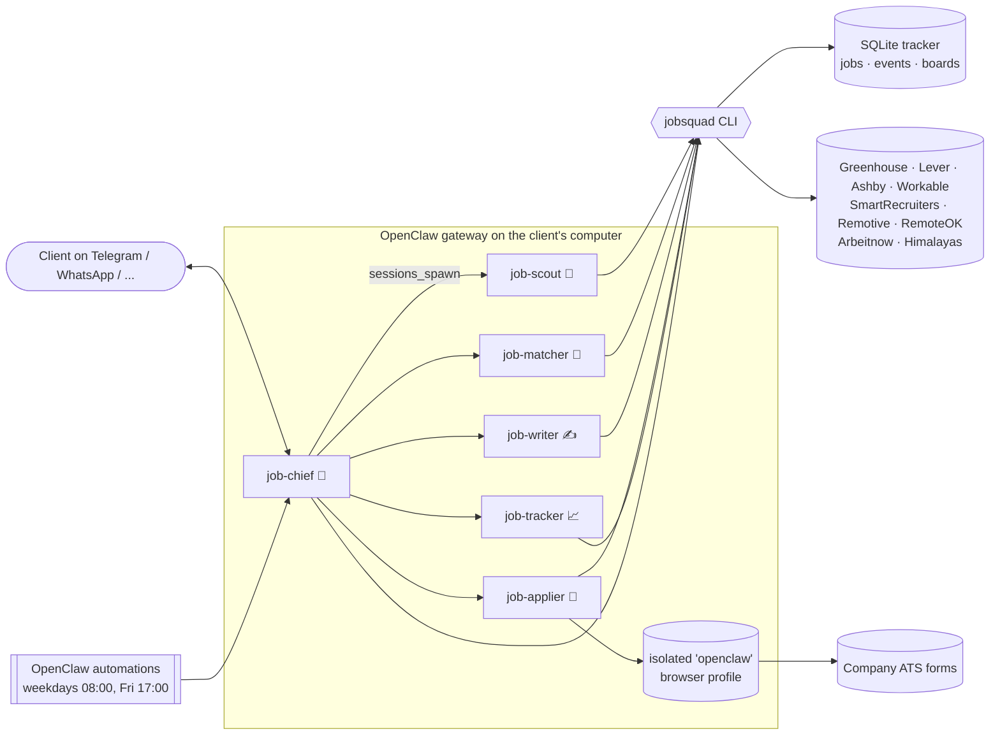
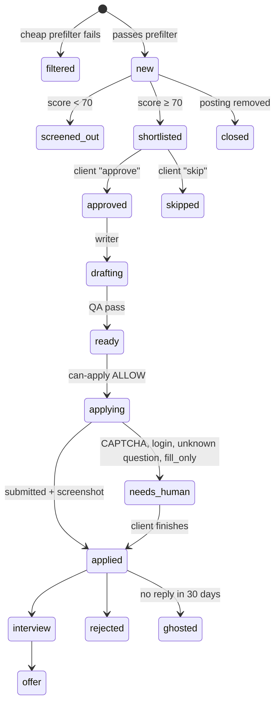

# JobSquad design

## Goals
1. Find relevant openings every day without the client searching.
2. Apply with quality: every document is tailored and every claim is true.
3. Keep the client in control, and keep the client's reputation safe with recruiters.
4. Install on any client computer in minutes, and upgrade without losing data.
5. Keep model cost low: spend tokens on judgment and writing, not on plumbing.

## Architecture



**Why one coordinator plus specialists?** Each specialist has a small, stable instruction set and a narrow tool policy, which makes it more reliable and lets it run on a cheaper model. Only the Chief talks to the client, so the client sees one voice.

**Why a CLI instead of letting agents reason about state?** Anything that must be correct every time is code: deduplication, filters, status transitions, caps, QA, the apply gate. Agents call `jobsquad` and read its output. Agents are stateless between runs; the database is the memory, so a scheduled run and a chat reply can pick up the same job by id.

## Data layout on a client machine

```
~/jobsquad/                         (JOBSQUAD_HOME)
  client/client.jsonc               search, mode, limits, sources, writing prefs
  client/answers.jsonc              standard form answers (identity, work auth, salary, EEO, consent)
  client/master_resume.md           the only source of truth about the candidate
  client/resume.pdf                 original résumé (optional)
  data/jobsquad.db                  tracker (jobs, events, boards, meta)
  applications/<id>/                job.md, resume.md, cover_letter.md, answers.md, PDFs, evidence/
  reports/                          weekly reports, CSV exports
  app/                              runtime code (replaced on upgrade)
  bin/jobsquad(.cmd)                wrapper with JOBSQUAD_HOME baked in
~/.openclaw/workspace-job-*/        each agent's AGENTS.md, SOUL.md, IDENTITY.md, USER.md, skills/
```

## Job lifecycle



## Daily flow
1. **Fetch (deterministic, 0 tokens):** about 3,000 postings from configured boards and feeds. Prefilter on title, exclusions, location/remote and age; fingerprint dedup across sources; postings that disappear from a board are marked closed. Typically about 1% pass.
2. **Score (Matcher):** at most 40 per run, so cost is bounded. Hard gates (work authorization, location, seniority, language, salary, deal-breakers) cap the score at 20. Reasons are 140 characters or fewer, so the client can decide quickly.
3. **Digest (Chief):** new matches with id, score, reason and link, plus jobs still waiting, applications sent, items that need the client, and follow-ups due.
4. **Approve → Write → Gate → Apply:** per job. Writers run in parallel; the applier runs one at a time (single browser).
5. **Weekly (Tracker):** funnel, tuning suggestions drawn from filter reasons and skip notes, CSV.

## Guardrails
| Risk | Control |
|---|---|
| Fabricated experience | Writer instructions + `jobsquad qa`: new capitalized terms or numbers absent from the master résumé fail the package |
| Wrong company in letter | QA: letter must name the target company and must not name other companies in the pipeline |
| Spamming employers | `max_applications_per_day` (rolling 24h), `max_per_company_30d`, duplicate-posting check |
| Applying without consent | Review mode by default; `approve` requires `--msg` with the client's words; `set approved` is refused |
| Auto mode overreach | Score ≥ 85 AND ATS in `auto_submit_ats` AND all caps; otherwise falls back to review |
| ToS / bot detection | Public JSON APIs only; LinkedIn/Indeed/Glassdoor/ZipRecruiter on `never_apply_domains`; no accounts, no passwords, no CAPTCHAs |
| Scams | Applier stops on payment requests or sensitive ID/bank fields and flags them |
| Double submission | One Submit click; unclear outcome → needs_human, never retry |
| Data leaks | Client data only typed into apply URLs that passed the gate; isolated browser profile; Chief has no browser |
| Silent failures | Board error counters, `stats` shows broken boards, OpenClaw failure alerts on automations |

## Cost shape (rough)
- Fetch and filter: no model calls.
- Matcher: about 40 short reads a day. Use `--fast-model` (a Sonnet/Haiku-class model) for Scout, Matcher and Tracker.
- Writer: the most expensive step, but it runs only for approved jobs, so it's capped by the daily limit.
- Applier: browser snapshots dominate; one job per run.

## Extending
- **New source:** add a fetcher to `runtime/lib/sources.mjs` (board or feed) that returns the normalized job shape.
- **Email tracking:** OpenClaw's Gmail Pub/Sub trigger can wake job-tracker on recruiter replies (see the OpenClaw docs, automation → Gmail).
- **Different languages:** set `client.language`; the Writer writes in the posting's language unless told otherwise.
